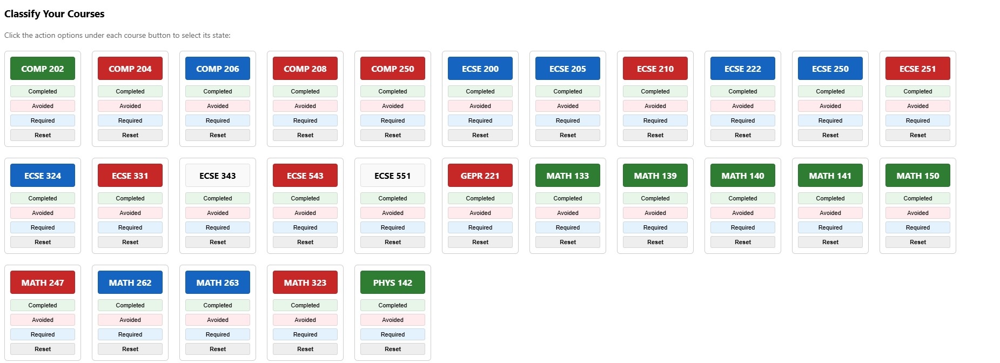
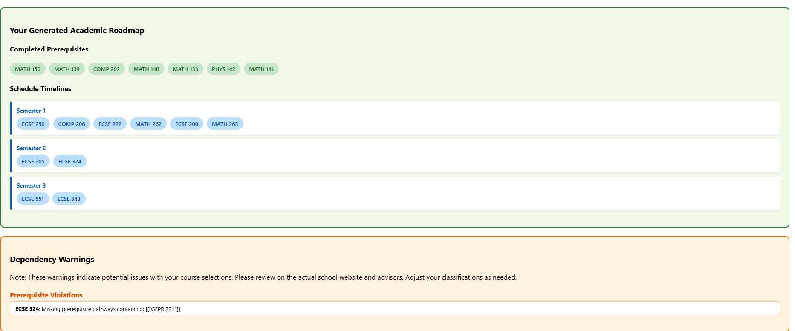
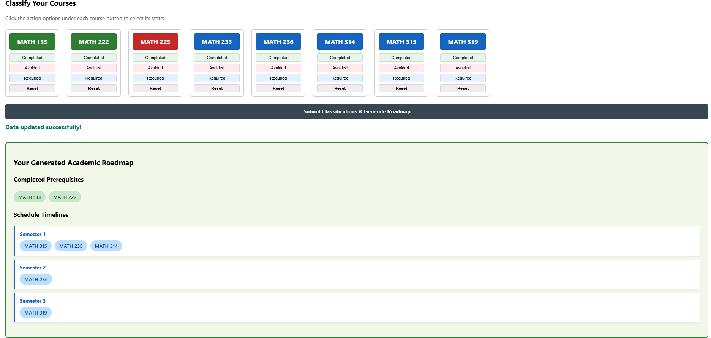
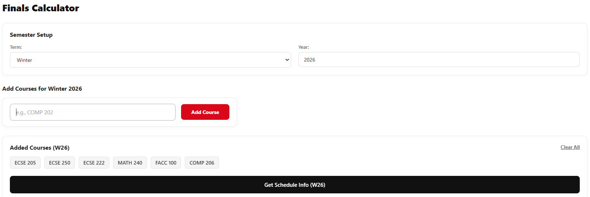
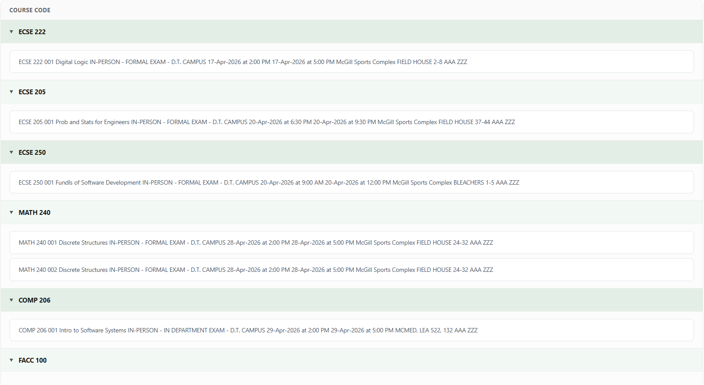

# Course Dependency Graph Generator

A full-stack application that extracts, models, and visualizes McGill University course hierarchies and final exam schedules. The system maps complex academic prerequisites and co-requisites into a Directed Acyclic Graph (DAG) to help students validate academic progression paths and resolve enrollment sequences using topological sorting. 

This project was built as a personal learning initiative to deepen my engineering skills across full-stack development and manage complex asynchronous client-server interactions. To create a highly responsive, modern user experience, I leveraged advanced AI tools, including Google AI models and ChatGPT, to refine the React visualization interface.

*Note: This repository serves as a lightweight architectural overview, showcasing the structural configuration, interface design, and method signatures of the application rather than the complete source implementation. In order to protect the intellectual property and personal effort invested in developing this system, the comprehensive execution logic has been kept private. If you would like to explore the full, integrated codebase, please reach out to me directly using the contact email provided on my CV.*


## 🏗️ Architecture & Data Model

The application uses a relational schema designed to handle logical groups of prerequisites (e.g., requiring *Course A* **AND** *Course B*) and final exam schedules.

### Data Relations Key
* **courses ➔ finals:** Maps physical exam locations, dates, and times directly to individual course tracking nodes.
* **courses ➔ course_requirements:** Hooks target courses into unique evaluation rules specifying if relationships are prerequisites (`PRE`) or concurrent co-requisites (`CO`).
* **course_requirements ➔ requirement_items:** Bridges systemic rule containers to the concrete list of alternate course codes needed to clear registration locks.
### Database Relationships

| Source Table | Relation | Target Table | Description |
| :--- | :---: | :--- | :--- |
| `courses` | 1 ➔ ∞ | `finals` | Links specific exam schedules to course nodes. |
| `courses` | 1 ➔ ∞ | `course_requirements` | Connects a course to its rule groups (`PRE` / `CO`). |
| `course_requirements` | 1 ➔ ∞ | `requirement_items` | Lists the actual courses that satisfy each rule group. |

---

## 🚀 Tech Stack

*   **Backend System:** Java Servlets deployed on an Apache Tomcat server
*   **Frontend UI:** React.js (Interactive graph visualization rendering dependency trees)
*   **Database:** MySQL (Relational storage for 10,145+ courses and 3,121+ relationship groups)
*   **Data Pipeline:** Python (Web scraping, advanced text data normalizing using regex, and batch SQL database seeding)

## 🐍 Data Ingestion & Preprocessing (Python Pipeline)

> **Note:** The source ingestion scripts are omitted from this public repository due to third-party data ownership and web-scraping restrictions. 

Before running the application, a separate **Python data pipeline** was built to populate the database:
* **Extraction:** Scraped raw academic catalog datasets and final exam schedules directly from McGill University's public web portals.
* **Data Cleaning & Normalization:** Cleaned loose text strings, fixed irregular formatting, and structured complex prerequisite strings into predictable target blocks.
* **Database Seeding:** Automatically populated the MySQL server with **10,145 records** across the schema tables, initializing **3,121 unique relationship groups** (`PRE` and `CO` rules).

## ⚙️ Backend Module Breakdown

The Java backend handles data extraction, graph building, topological sequencing, and API routing through the following core components:

* **Connector (Excluded from Repo):** Manages the JDBC connection lifecycle to safely communicate with the MySQL database instance. This file is withheld from the public repository for security reasons to protect database access credentials.
* **Collector:** Queries the relational database and extracts target courses alongside their corresponding requisite groups, mapping them into optimized standard `HashMap` structures.
* **Courses (Graph Engine):** Constructs the localized dependency sub-graph centered around a requested target course. It features a custom, pseudo-BFS algorithm tracking unmet dependency counters within a tracking map to perform topological sorting and determine safe academic pathways.
* **Finals:** Retrieves final exam data from the database and packages it into a chronological JSON payload organized strictly by calendar examination days.
* **DataServlet:** The system's HTTP gateway. It handles client communication on the Apache Tomcat server using standard HTTP protocols to link React and Java.
## 🔄 Client-Server Communication Flow

The React frontend interacts with `DataServlet` using asymmetric HTTP methods depending on the data flow:

* **Data Submission (`POST`):** The React frontend issues `POST` requests to transmit user inputs, course parameters, or specific selections down to the Java backend processing layer.
* **Data Retrieval (`GET`):** The client issues `GET` requests to catch compiled information payloads, generated JSON graph maps, and processed exam schedules from the servlet.
## ⚠️ Data Constraints & Parsing Limitations

Because academic prerequisite information on university portals is written by humans and updated irregularly, text formats vary significantly between departments. 

*   **Parsing Ambiguity:** The system isolates specific requirement structures, but parsing highly irregular text strings (especially complex nested **OR** groups) can occasionally result in formatting discrepancies.
*   **Verification:** Users should always cross-reference critical or non-standard dependency paths directly on the official school website or McGill eCalendar to verify edge cases.
## 🛠️ Setup Instructions

### Prerequisites
*   **MySQL Server:** To host and manage the relational database schema.
*   **Java Development Kit (JDK 11 or higher):** To build and compile the Java components.
*   **Apache Tomcat Server:** To host and deploy the backend Java Web Application servlets.
*   **Node.js & npm:** To install front-end dependencies and run the development server.

### 1. Database Setup
1. Open your MySQL client and create a new database instance:
   ```sql
   CREATE DATABASE mcgill_graph;
   ```
2. Generate the necessary tables (`courses`, `course_requirements`, `requirement_items`, and `finals`) using your preferred database administration interface.
3. **Data Ingestion Notice:** Because the production McGill dataset and raw scraping scripts are excluded, the database tables will initially be empty. To test or use the project, you must provide your own data. It is highly recommended to build a custom **Python script** utilizing libraries such as `pymysql` or `mysql-connector-python` to parse, format, and batch-insert your local dataset into the structured tables.

### 2. Backend Configuration
1. Import the project into your preferred Java IDE as a Web Application project.
2. **Create Your Database Connector:** Because `Connector.java` is excluded from this repository for security reasons, you must create your own connection manager class. Configure it with your local JDBC parameters:
   ```java
   String url = "jdbc:mysql://localhost:3306/mcgill_graph";
   String username = "YOUR_DATABASE_USERNAME";
   String password = "YOUR_DATABASE_PASSWORD";
   ```
3. Compile the Java source code into a standard distribution `.war` file, or deploy it directly onto your local running **Apache Tomcat** server instance.
### 3. Frontend Setup
1. Navigate to your frontend source directory using your terminal.
2. Install the application's package dependencies:
   ```bash
   npm install
   ```
3. Boot up the local development web server:
   ```bash
   npm start
   ```
## 📸 Screenshots from the Actual Application

Below are real-world test cases demonstrating how the engine parses, validates, and schedules complex McGill department tracks.

### ⚡ Case Study 1: U1 Computer/Software Engineering & Machine Learning
This scenario highlights the engine's ability to handle parallel hardware/software pipelines, manage deep mathematical prerequisites leading to `ECSE 551`, and throw validation warnings for legacy or missing data tracks (like `GEPR 221`).

#### 1. Course Classification Input


#### 2. Generated Timeline & Warnings


---

### 🧮 Case Study 2: Pure & Applied Mathematics Track
This layout demonstrates a clean math major curriculum layout, highlighting strict linear progressions and multi-parent node convergence leading up to upper-year capstones like `MATH 319`.

#### 1. Course Classification Input


#### 2. Generated Timeline


---

### 📅 Case Study 3: Winter 2026 Final Exam Schedule Generator
Beyond curriculum planning, the application parses McGill final exam data feeds. It automatically correlates your selected courses with their corresponding official dates, times, locations, and building seating zones.

#### 1. Selection State Input


#### 2. Generated Exam Schedule & Locations

